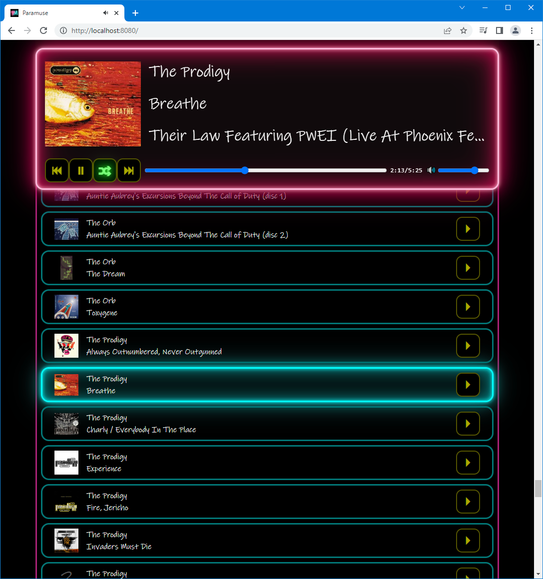
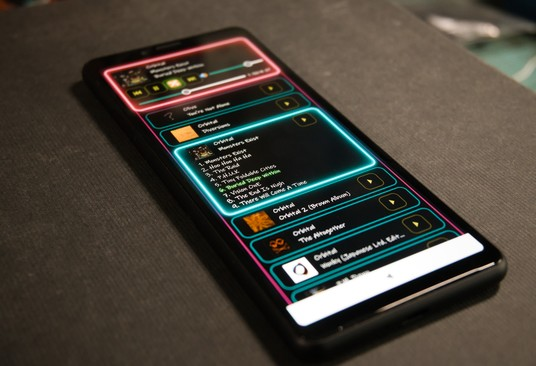

# Paramuse

Paramuse is a music server which can stream music over a network to a web browser. I wrote it to meet some specific requirements:

* Play whole albums, chosen at random.
* Use a web browser as a client, so it works on every platform.
* Support [ReplayGain](https://en.wikipedia.org/wiki/ReplayGain).

I mostly intended it for use on a LAN, so it has no built-in security. If you want to use it over the internet, you will need to secure it behind a VPN, or reverse proxy or something, so it isn't publicly accessible.

This is what it looks like running on a PC:  

And on a phone:  

## Requirements

### Server

* [.NET 6](https://dotnet.microsoft.com/en-us/download/dotnet/6.0). Both the .NET Runtime (or Desktop Runtime) _and_ the ASP.NET Core Runtime are required.
* Windows 7 or newer (it will run on other OSes, but you'll have to recompile it from source).
* Lots of music in MP3, OGG, or FLAC format.

### Client

* A fairly new web browser. Current versions of Firefox and Chrome will work. It might not work properly on older phone browsers.

## Installation

Assuming you're using the precompiled version, not compiling it yourself, then:

* Extract the zip somewhere.
* Edit `appsettings.json` and set `BasePath` to where your music is stored.

## Running the server

Just run the executable. It may take anywhere from a few seconds to a few minutes to scan through all the available music, depending on how much there is, and how fast the computer is.

All audio files in the same folder are treated as a single album, so for Paramuse to work as intended, you have to organize your music into separate folders. Note that Paramuse only scans for music on startup, so if you want it to pick up any changes to your music library, you have to restart it.

Album, track, and artist names are read from tags where available. If not, Paramuse will assume the folder is the album name, and the parent folder is the artist name.

## Running the client

Open a web browser and go to `http://localhost:8080`. It might take a while to load initially if you have a lot of music. Of course if the browser isn't on the same machine as the server, then replace "localhost" with the address of the machine the server is running on.

Once it's finished loading, press the play/pause button to start playing a random album, or scroll through the list and press the play button next an album to play it.

The button with the squiggly arrows next to the play/pause button toggles shuffling. When it's enabled (glowing green) then when the current album is finished, the next one will be chosen at random. When it's disabled, albums will be played sequentially from the list (alphabetical order).

Click on an album in the list to expand it to see all the tracks it contains. If one is currently playing, it will be highlighted.

Note that the volume control goes from -18dB all the way up to +6dB (in 1dB steps). This is because most modern music will have ReplayGain gain that is strongly negative, due to the [loudness war](https://en.wikipedia.org/wiki/Loudness_war), ao settings above 0dB may be helpful to bring the overall volume back up closer to full. This risks making any less-compressed tracks sound relatively too quiet though. If your music doesn't have ReplayGain tags, then setting the volumn above 0dB will not increase the volume any higher than 0dB.

## Possible problems

* _Pressing play doesn't work the first time, or playback stops after every track._ Autoplay must be allowed in the browser.
* _An album cover won't load, even though one is available._ This might be because the image is corrupt. Paramuse will try to load images from inside audio files if present, and those can be corrupt too.
* _The server won't start from a command line or batch file etc._ Make sure the current working directory is set to where `Paramuse.exe` is.

## Other stuff

Paramuse uses the following libraries:
* [ImageSharp](https://github.com/SixLabors/ImageSharp) ([Apache License, Version 2.0](<Library Licenses/LICENSE-2.0.txt>))
* [TagLib-sharp](https://github.com/mono/taglib-sharp) ([LGPL-2.1](<Library Licenses/COPYING>))
